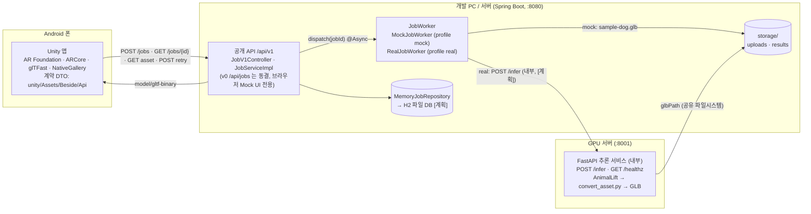
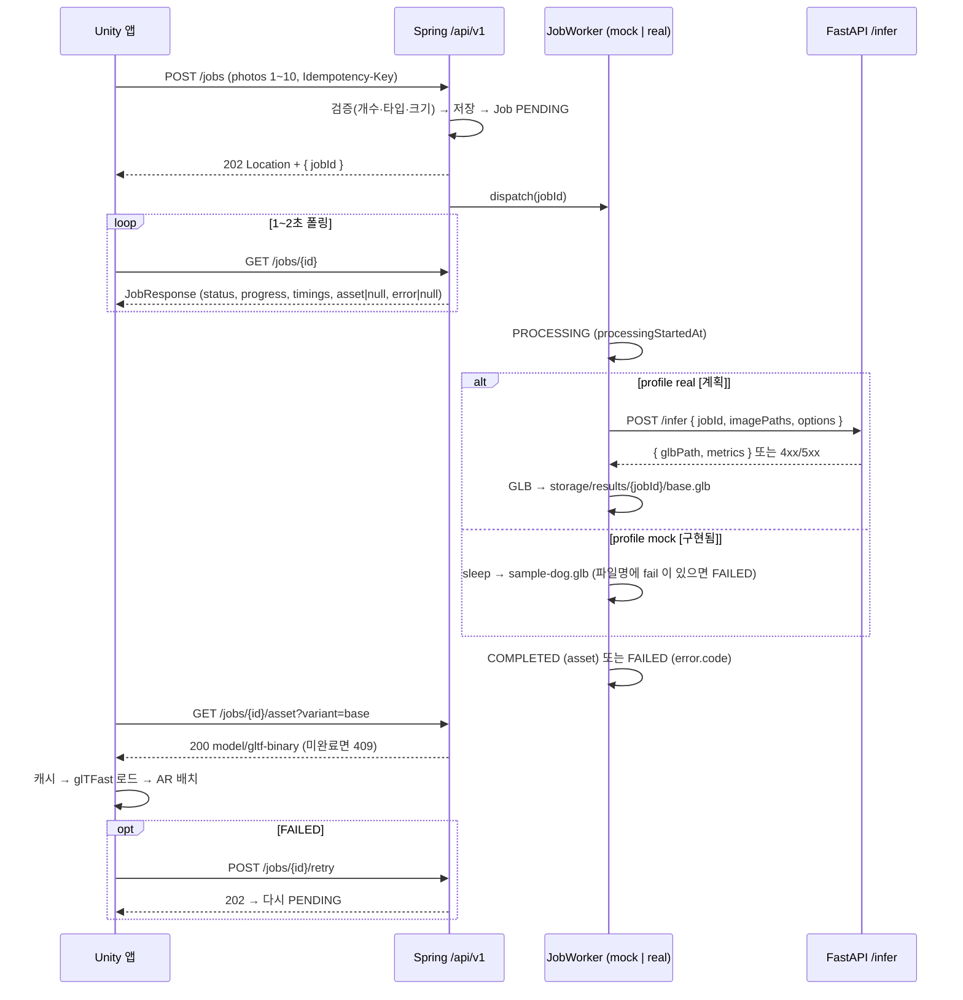
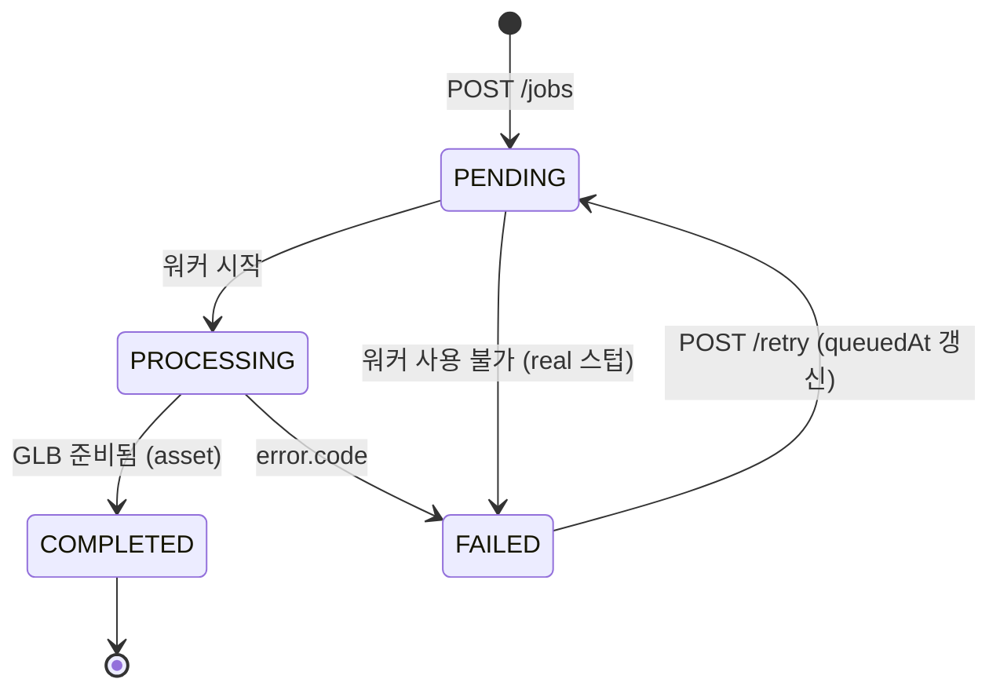

# 아키텍처

결정됨(재논의하지 않는다): **Unity Android 앱(ARCore, glTFast) ↔ Spring Boot 공개 API(Job 상태·저장·에셋 서빙) ↔ Python 추론 서비스(FastAPI, GPU, AnimalLift + GLB 변환, 내부 전용 `POST /infer`)**. Spring 은 profile 로 `mock | real` 워커를 교체하고 real 워커가 Python 을 호출한다. Unity 는 Spring API 계약 v1 만 본다.

상태: Spring(v0·v1·Mock 워커)과 계약 문서는 **[구현됨]**, Unity 앱·AnimalLift 추론·real 워커 호출은 **[계획]** ([PLAN.md](PLAN.md)).

## 구성 요소



## 데이터 흐름



## Job 상태 머신



`timings.queuedMs` 는 PENDING 구간, `processingMs` 는 PROCESSING 구간, `totalMs` 는 접수(또는 retry)부터 종료까지. 상태는 결과 메타데이터를 채운 뒤 마지막에 바꾼다.

## 프로파일

| | `mock` (기본, `spring.profiles.default`) | `real` |
|---|---|---|
| 워커 | `MockJobWorker`: 고정 지연 후 샘플 GLB. 파일명 `fail` 트리거 | `RealJobWorker`: `POST {inference.base-url}/infer` **[계획]** — 현재 스텁은 `INFERENCE_UNAVAILABLE` 로 FAILED |
| 설정 파일 | `application-mock.properties` (`mock.worker.*`, `storage.result.sample`) | `application-real.properties` (`inference.base-url`, `inference.timeout-ms`) |
| GPU | 불필요 | FastAPI 서비스가 GPU 서버에서 실행 |
| 용도 | Unity·브라우저 개발, 계약 테스트, 데모 백업 | 4단계 실 연동 이후 |
| healthz | `{ "profile": "mock", "workerType": "mock" }` | `{ "profile": "real", "workerType": "real" }` |

실행: `.\gradlew.bat bootRun` / `.\gradlew.bat bootRun --args="--spring.profiles.active=real"`.

## 저장소 레이아웃

```text
backend/storage/
├─ uploads/{jobId}_{원본파일명}        # 업로드 사진 (gitignore). 같은 이름이면 -2, -3 접미사
├─ results/sample-dog.glb             # Mock 샘플 — 현재 0바이트, 유효 GLB 로 교체(직접 할 일)
├─ results/{jobId}/base.glb           # real 결과 [계획]
├─ results/{jobId}/hair.glb           # real 결과, options.hair [계획]
├─ results/{jobId}/*.metrics.json     # 변환기 출력 [계획]
└─ events.jsonl                       # 측정 로그 (METRICS §1) [계획]
```

서버 내부 경로는 어떤 API 응답에도 나가지 않는다. v1 은 `asset.url`(상대 경로)만 준다.

## 배포 가정

- 개발: 폰과 PC 는 같은 Wi-Fi, `http://<PC IP>:8080`, 방화벽 8080 허용, 앱은 개발용 cleartext 허용. 절차는 [unity/README.md](../unity/README.md).
- Spring ↔ Python: **같은 호스트 또는 공유 볼륨**(1차 가정). `/infer` 가 업로드 경로를 읽고 GLB 경로를 돌려준다. 분리 배포가 필요하면 바이너리 전송으로 바꾼다(계약 회의 안건).
- 보안: 캡스톤 범위에서는 인증 없음. 공개 배포 시 HTTPS·인증·업로드 바이러스 검사는 향후 과제.
- 동시성: Mock 은 작업마다 스레드(`@Async`, 기본 실행기). real 은 GPU 1장 기준 순차 처리.

## 계약 경계와 문서

| 경계 | 문서 | 보호 수단 |
|---|---|---|
| Unity ↔ Spring | [api/openapi.yaml](api/openapi.yaml), [api/ERROR_CODES.md](api/ERROR_CODES.md) | `JobV1ContractTest`, `JobV1ApiTest`, Unity DTO |
| Spring ↔ Python | [generation/inference_service/README.md](../generation/inference_service/README.md) | FastAPI 스키마(pydantic), 4단계 통합 테스트 [계획] |
| GLB 파일 | [asset/GLB_SPEC.md](asset/GLB_SPEC.md) | gltf-validator, 변환기 자체 검사, glTFast 로드 |
| 측정 이름 | [METRICS.md](METRICS.md) | 세 트랙 공통 표기 |
