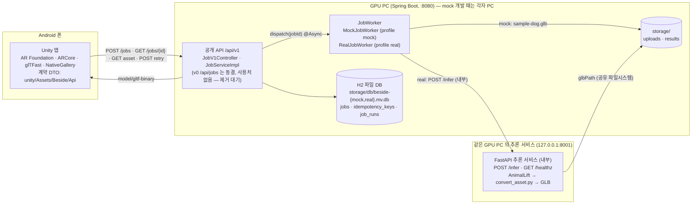
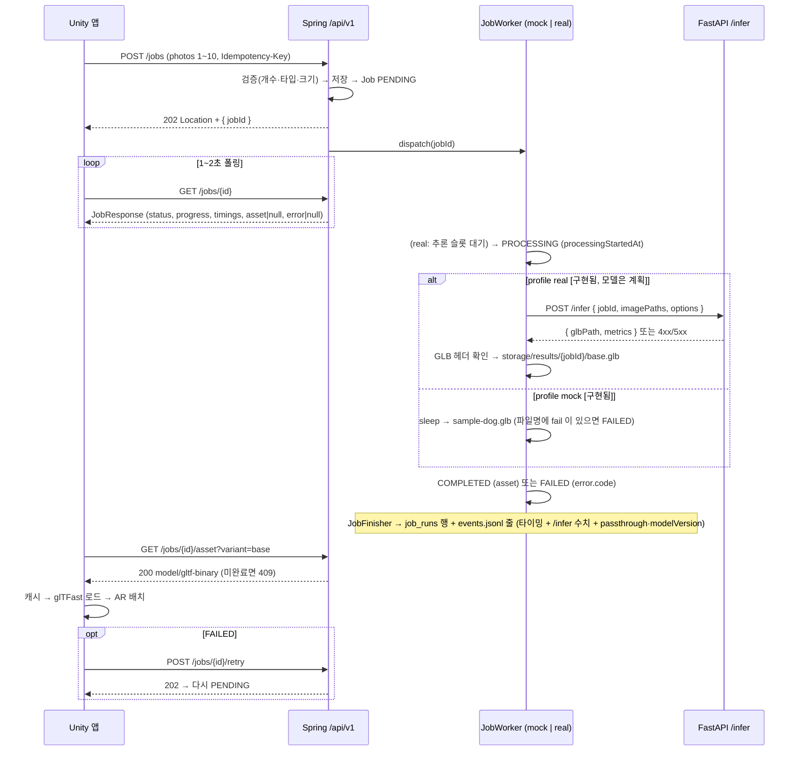
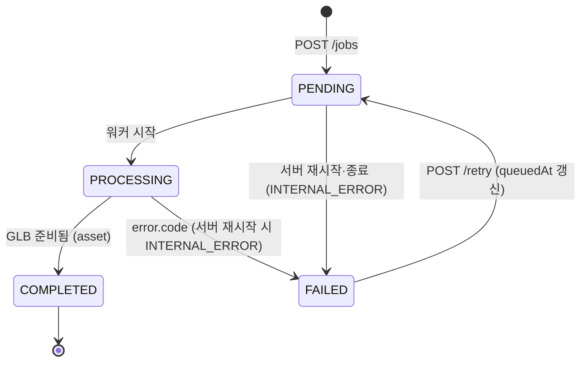

# 아키텍처

결정됨(재논의하지 않는다): **Unity Android 앱(ARCore, glTFast) ↔ Spring Boot 공개 API(Job 상태·저장·에셋 서빙) ↔ Python 추론 서비스(FastAPI, GPU, AnimalLift + GLB 변환, 내부 전용 `POST /infer`)**. Spring 은 profile 로 `mock | real` 워커를 교체하고 real 워커가 Python 을 호출한다. Unity 는 Spring API 계약 v1 만 본다.

상태: Spring(v0·v1·Mock/real 워커·H2 저장소·실행별 측정 `job_runs`)과 계약 문서는 **[구현됨]**(real 워커의 `/infer` 호출은 FastAPI 스텁 패스스루로 확인), Unity 앱은 팀원 완료 보고 후 **PR 대기**, AnimalLift 추론은 **[계획]** ([PLAN.md](PLAN.md)). 실제 E2E 배치는 팀원 GPU PC 한 대에 Spring 과 추론 서비스를 함께 두기로 했다(2026-10-05).

## 구성 요소



## 데이터 흐름



## Job 상태 머신



서버가 다시 시작되면 PENDING/PROCESSING 으로 남은 작업은 FAILED(`INTERNAL_ERROR`)가 된다. 작업 기록은 H2 에 남지만 워커 스레드는 남지 않기 때문이며, 앱은 retry 로 다시 실행한다 (`InterruptedJobRecovery`, 웹 서버가 요청을 받기 전에 실행).

`timings.queuedMs` 는 PENDING 구간, `processingMs` 는 PROCESSING 구간, `totalMs` 는 접수(또는 retry)부터 종료까지. 상태는 결과 메타데이터를 채운 뒤 마지막에 바꾼다.

## 프로파일

| | `mock` (기본, `spring.profiles.default`) | `real` |
|---|---|---|
| 워커 | `MockJobWorker`: 고정 지연 후 샘플 GLB. 파일명 `fail` 트리거 | `RealJobWorker`: 추론 슬롯 대기 → `POST {inference.base-url}/infer` → 결과 GLB 복사 **[구현됨]**. 실제 모델은 [계획](지금은 FastAPI 패스스루) |
| 설정 파일 | `application-mock.properties` (`mock.worker.*`, `storage.result.sample`) | `application-real.properties` (`inference.base-url`, `inference.timeout-ms`, `inference.max-concurrency`, `storage.result.dir`) |
| GPU | 불필요 | FastAPI 추론 서비스가 같은 GPU PC 에서 실행(`scripts/run_real.ps1`) |
| 용도 | Unity·브라우저 개발, 계약 테스트, 데모 백업 | Spring↔Python 연동 시험(패스스루), 실제 모델 E2E(10-20 주 선행), 4단계 실 연동 |
| healthz | `{ "profile": "mock", "workerType": "mock" }` | `{ "profile": "real", "workerType": "real" }` |
| DB 파일 | `storage/db/beside-mock.mv.db` (+ `/h2-console`) | `storage/db/beside-real.mv.db` (+ `/h2-console` — `job_runs` 측정표 내보내기, METRICS §1.1) |

실행: `.\gradlew.bat bootRun` / `.\gradlew.bat bootRun --args="--spring.profiles.active=real"`.

## 저장소 레이아웃

```text
backend/storage/
├─ db/beside-mock.mv.db               # H2, profile mock (gitignore): 테이블 jobs · idempotency_keys · job_runs(실행별 측정)
├─ db/beside-real.mv.db               # H2, profile real (gitignore): 같은 테이블 3개 — 측정표는 이 파일에서
├─ uploads/{jobId}_{원본파일명}        # 업로드 사진 (gitignore). 같은 이름이면 -2, -3 접미사
├─ results/sample-dog.glb             # Mock 샘플 — 현재 0바이트, 유효 GLB 로 교체(직접 할 일)
├─ results/{jobId}/base.glb           # real 결과 [구현됨] — /infer 의 glbPath 를 복사 (gitignore)
├─ results/{jobId}/hair.glb           # real 결과, options.hair [계획]
├─ results/{jobId}/*.metrics.json     # 변환기 출력 [계획]
└─ events.jsonl                       # 측정 로그, 실행이 끝날 때마다 한 줄 (METRICS §1, gitignore)
```

서버 내부 경로는 어떤 API 응답에도 나가지 않는다. v1 은 `asset.url`(상대 경로)만 준다.

## 배포 가정

- 개발: 폰과 PC 는 같은 Wi-Fi, `http://<PC IP>:8080`, 방화벽 8080 허용, 앱은 개발용 cleartext 허용. 절차는 [unity/README.md](../unity/README.md).
- 실제 모델 E2E(결정 2026-10-05): Spring 과 추론 서비스를 **팀원 GPU PC 한 대**에 함께 띄운다(`scripts/run_real.ps1`, [backend/README.md](../backend/README.md) 'GPU PC 에 real 배치'). 추론 서비스는 127.0.0.1:8001 에만 묶고 Spring 의 8080 만 LAN 에 연다. 폰은 그 PC 의 IP 로 붙는다(Mock 과 같은 절차). H2 파일·업로드·결과 GLB 도 그 PC 에 있다. 리포는 ASCII·공백 없는 경로에 둔다(한글·공백 경로는 모델 쪽 이미지 로더가 못 읽을 수 있다).
- Spring ↔ Python: **같은 호스트**(결정; 공유 볼륨은 대안). `/infer` 가 업로드 경로를 읽고 GLB 경로를 돌려준다. 분리 배포가 필요해지면 바이너리 전송으로 바꾼다(계약 회의 안건 #6, `InferenceClient` 만 교체).
- 보안: 캡스톤 범위에서는 인증 없음. 공개 배포 시 HTTPS·인증·업로드 바이러스 검사는 향후 과제.
- 동시성: Mock 은 작업마다 스레드(`@Async`, 기본 실행기). real 은 `inference.max-concurrency`(기본 1 = GPU 1장)건만 `/infer` 를 부르고 나머지는 PENDING 으로 기다린다 **[구현됨]**.
- DB: 서버 하나가 H2 파일 하나를 연다(AUTO_SERVER 없음). 같은 파일로 두 번째 서버를 띄우면 시작 단계에서 실패한다. 다른 인스턴스는 `--storage.db.path` 로 다른 파일을 쓴다.

## 계약 경계와 문서

| 경계 | 문서 | 보호 수단 |
|---|---|---|
| Unity ↔ Spring | [api/openapi.yaml](api/openapi.yaml), [api/ERROR_CODES.md](api/ERROR_CODES.md) | `JobV1ContractTest`, `JobV1ApiTest`, Unity DTO |
| Spring ↔ Python | [generation/inference_service/README.md](../generation/inference_service/README.md) | FastAPI 스키마(pydantic), `InferenceClientTest`·`RealJobWorkerTest`(가짜 `/infer`) [구현됨], 실제 모델 통합 테스트 [계획] |
| GLB 파일 | [asset/GLB_SPEC.md](asset/GLB_SPEC.md) | gltf-validator, 변환기 자체 검사, glTFast 로드 |
| 측정 이름 | [METRICS.md](METRICS.md) | 세 트랙 공통 표기 |
