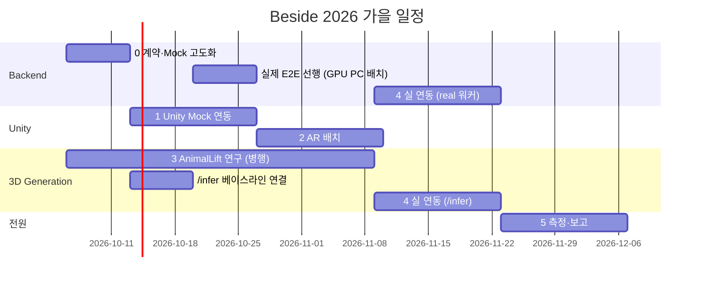

# 단계별 계획 (PLAN)

기준일: **2026-10-06(월) 주차 시작**. 표기: **[구현됨]** 코드·테스트가 리포에 있음 / **[실험 결과]** 측정값이 기록됨 / **[계획]** 아직 안 함 / **직접 할 일** 코드로 해결되지 않아 사람이 해야 함. 아직 하지 않은 것을 한 것처럼 쓰지 않는다. 이 문서는 주 1회 계약 회의에서 갱신한다.

## 한눈에 보기

| 단계 | 기간 | 주 담당 | 핵심 산출물 | 상태 (2026-10-06) |
|---|---|---|---|---|
| 0 계약·Mock 고도화 | 10-06 ~ 10-12 (1주) | Backend, 전 트랙 리뷰 | API v1 동결, Mock 서버 v1, 문서 뼈대 | 계약·코드·문서·H2·events.jsonl·app.js v1 **[구현됨]**, 계약 회의·GLB 교체 등 **직접 할 일** 남음 |
| 1 Unity Mock 연동 | 10-13 ~ 10-26 (2주) | Unity | 갤러리 → 업로드 → 폴링 → 다운로드 → 로드 (Mock) | 팀원이 완료 보고(2026-10-05), **PR 대기** — 머지 후 [구현됨] 표기 |
| 2 AR 배치 | 10-27 ~ 11-09 (2주) | Unity | AR 평면 배치, 스케일/회전, metrics.csv | **[계획]** |
| 3 AnimalLift 연구 | 10-06 ~ 11-08 (5주, 병행) | 3D Generation | 베이스라인 재현 → `/infer` 연결·**실제 E2E 선행** → 개선 실험 ≥ 2 (순서 변경 10-06) | **[계획]** |
| 4 실 연동 | 11-09 ~ 11-22 (2주) | Backend + Generation, Unity 검증 | real 워커 ↔ `/infer`, 실제 GLB 서빙 | real 워커 ↔ `/infer`·실행별 측정 `job_runs`·GPU PC 배치 절차 **[구현됨]**(패스스루 검증), 실제 모델 E2E **[계획]**(10-20 주 선행) |
| 5 측정·보고 | 11-23 ~ 12-06 (2주) | 전원 | 측정표, 발표, 보고서, 데모 | **[계획]** |

의존 관계: 0 → 1 → 2, 0 → 3(병행), (2, 3) → 4 → 5. 3단계는 GPU 서버 확보(직접 할 일)에 의존한다. 실제 E2E 선행(10-20 주)은 1단계 PR 머지, exp-01, `convert_asset.py` 투입에 의존한다.

---

## 0단계 — 계약·Mock 고도화 (2026-10-06 ~ 10-12)

담당 Backend. 리뷰 Unity·Generation(계약 회의 1회, 안건은 [docs/api/REVIEW_CHECKLIST.md](api/REVIEW_CHECKLIST.md)). 의존 없음 — 다른 모든 단계의 전제.

| 항목 | 상태 | 비고 |
|---|---|---|
| API v1 계약 `openapi.yaml`, `ERROR_CODES.md`, `CHANGELOG.md` | **[구현됨]** 2026-10-04 | 계약 회의 후 `git tag api-v1.0` |
| Spring v1 엔드포인트(create/get/asset/retry/list/healthz), Mock 워커(실패 트리거, Idempotency-Key, timings) | **[구현됨]** | `JobV1ApiTest` |
| 계약 테스트 `openapi.yaml` ↔ `/v3/api-docs` | **[구현됨]** | `JobV1ContractTest` |
| profile `mock \| real` 분리, real 워커 스텁 | **[구현됨]** | `/infer` 호출은 2026-10-04 4단계 선행으로 구현 |
| `GLB_SPEC.md`, `METRICS.md`, `ARCHITECTURE.md` | **[구현됨]** | 숫자 상한은 제안값 |
| Unity 계약 DTO (`unity/Assets/Beside/Api`) | **[구현됨]** | 알 수 없는 enum → Unknown |
| FastAPI `/infer` 스텁 (501 + 패스스루) | **[구현됨]** | 모델 로드는 3단계 |
| e2e 스크립트 (`scripts/e2e_mock.ps1`, `.sh`) | **[구현됨]** | |
| 0바이트 `sample-dog.glb` → GLB_SPEC 을 만족하는 유효 GLB 로 교체 | **직접 할 일** | Unity 로드 검증의 전제 |
| `convert_asset.py` 투입 (`generation/tools/`) | **직접 할 일** | 별도 세션 결과물, 인터페이스 맞추기 |
| Unity 프로젝트 생성(Unity Hub 2022.3 LTS, 패키지 설치) | **직접 할 일** | 1단계 선행 |
| GPU 서버 확보, 접속 정보 | **결정됨** 2026-10-05: 팀원 개인 PC(GPU 장착). Spring 도 그 PC 에 함께 배치(REVIEW_CHECKLIST #6 (a) 제안) | Java 17·리포 클론(ASCII 경로)·방화벽·IP 공유는 **직접 할 일** — [backend/README](../backend/README.md) 'GPU PC 에 real 배치', `scripts/run_real.ps1` |
| 메모리 저장소 → **H2 파일 DB** (Job + Idempotency-Key 영속화) | **[구현됨]** 2026-10-04 | `JobPersistenceTest`. 재시작 때 진행 중이던 작업은 FAILED(`INTERNAL_ERROR`) → 앱이 retry |
| `events.jsonl` 기록기 (METRICS §1) | **[구현됨]** 2026-10-04 | 실행이 끝날 때마다 한 줄(`JobFinisher`). `JobEventsTest`. 실제 측정값은 아직 없음 |
| 브라우저 Mock UI `app.js` → v1 전환 | **[구현됨]** 2026-10-04 | Node 테스트 18개(실제 서버 라이브 포함) 통과. 오류 문구는 ERROR_CODES, GIF 거부. v0 API 는 동결 유지 |

완료 기준(DoD):
- [ ] 계약 회의에서 REVIEW_CHECKLIST 결정 → `CHANGELOG.md` 반영 → `git tag api-v1.0`
- [x] `cd backend; .\gradlew.bat test` 전부 통과, `node --test backend/src/test/js/mock-mvp.test.cjs` 통과 (2026-10-04 확인)
- [ ] `scripts/e2e_mock.ps1` 이 bytes > 0 인 GLB 를 받는다 (샘플 교체 후)
- [x] 서버 재시작 후 기존 jobId 조회가 200 (H2) — 2026-10-04 jar 강제 종료·재시작으로 확인. 같은 Idempotency-Key 도 같은 jobId
- [ ] Unity 프로젝트에서 `Assets/Beside` 가 오류 없이 컴파일된다

## 1단계 — Unity Mock 연동 (2026-10-13 ~ 10-26)

담당 Unity. 의존: 0단계 계약 동결, Mock 서버, 유효 GLB.

상태(2026-10-06): 팀원이 연동 완료를 보고했으나 PR 이 머지되지 않아 리포에는 없다 → 머지 후 아래 DoD 증빙(영상·logcat·metrics.csv)과 함께 **[구현됨]** 으로 바꾼다. real 연동(10-20 주) 때 바꿀 것: `maxWaitSeconds` 600, `progress` null 일 때 경과 시간 표시, `baseUrl` 을 GPU PC IP 로([unity/README.md](../unity/README.md) 'GPU PC real 서버').

산출물: NativeGallery 로 사진 선택(1~10장, 타입·용량 사전 검사) → `POST /api/v1/jobs` → 폴링(`JobStatus`, Unknown 처리) → `asset.url` 다운로드·캐시 → glTFast 로드(비AR 테스트 씬) → `error.code` 문구(ERROR_CODES) → retry 버튼 → `metrics.csv` 의 `uploadMs, waitMs, downloadMs, loadMs, e2eMs`.

| 주차 | 내용 |
|---|---|
| 10-13 ~ 10-19 | Unity 프로젝트·패키지, `BesideApiClient` 구현(업로드/조회/다운로드), 에디터에서 Mock 서버 전체 흐름 |
| 10-20 ~ 10-26 | NativeGallery, 실기기 연결(network_security_config), 오류/실패/retry UI, glTFast 로드, metrics.csv |

DoD:
- [ ] Android 실기기에서 PC Mock 서버로 전체 흐름 성공 (영상 + `adb logcat`)
- [ ] 파일명 `fail` 사진으로 FAILED → 문구 → retry → 다시 FAILED 흐름이 크래시 없이 동작
- [ ] 서버 꺼짐 / 404 / 409 / 413 각각 문구 표시
- [ ] `metrics.csv` 5개 열, 10회 측정값 표 **[실험 결과]** 로 기록

## 2단계 — AR 배치 (2026-10-27 ~ 11-09)

담당 Unity. 의존: 1단계 glTFast 로드 성공.

산출물: AR Foundation 평면 감지 → 탭 배치(원점 = 발바닥 접지) → 기본 스케일 0.6, 핀치 0.2~1.5, 회전 → 초기 정면이 카메라를 향함 → `avgFps, minFps, memMB` 기록 → (선택) `hair` 토글.

DoD:
- [ ] 실기기 바닥 평면 배치, 30초 측정 `avgFps` (목표 ≥ 30, 제안값) **[실험 결과]**
- [ ] 스케일·회전·재배치 조작
- [ ] `metrics.csv` 10열 모두 채움, 기기 2종 이상

## 3단계 — AnimalLift 연구 (2026-10-06 ~ 11-08, 병행)

담당 3D Generation. 의존: GPU 서버, 논문 공개 코드. 기록은 `generation/experiments/` (TEMPLATE 순서).

순서 변경(2026-10-06): 개선 실험 전에 **논문 원본 모델을 `/infer` 에 그대로 연결해 폰까지 가는 실제 E2E** 를 먼저 본다. 그래야 개선안마다 폰에서 바로 확인할 수 있고, 베이스라인 수치가 `job_runs` 에 쌓인다. 원래 11-02 주에 있던 `/infer` 연결을 10-13 주로 당기고, 실제 E2E 를 10-20 주에 넣는다.

| 주차 | 내용 | 기록 |
|---|---|---|
| 10-06 ~ 10-12 | 환경 구축(GPU PC), 공식 코드 실행, 샘플 1건 생성. **출력 파일 형식·1건 소요 시간·VRAM 을 기록**한다 — 문서의 `mesh.obj + uv.png (+ hair.npz)` 가정을 여기서 확인하고, 1건 시간은 `inference.timeout-ms`(제안: 3배) 와 Unity 최대 대기의 근거가 된다 | exp-01 |
| 10-13 ~ 10-19 | (앞당김) `convert_asset.py` 투입 → exp-01 출력으로 GLB_SPEC §8 통과 GLB 1개(0바이트 `sample-dog.glb` 교체) → `app.py` 의 501 TODO 를 실제 경로로(모델이 별도 conda env 면 subprocess), `modelVersion` 채움 → 우리 사진 3마리 이상으로 베이스라인 수치·품질 채점 | exp-02 |
| 10-20 ~ 10-26 | (앞당김, 4단계 선행) **실제 E2E**: GPU PC 에 `run_real.ps1` 로 Spring real + 추론 서비스 → PC 에서 `e2e_mock.ps1 -Photos <실제 사진> -TimeoutSeconds 600` → 폰(Unity)에서 실제 모델 AR 배치 → 10건 이상 → `job_runs` CSV 내보내기(METRICS §1.1) | exp-02 완성 (첫 [실험 결과]) |
| 10-27 ~ 11-08 | 개선 실험 ≥ 2건 — 실패 사례 → 가설 → 개선 → 비교. 개선안마다 E2E 로 폰에서 확인, `modelVersion` 으로 구분. 후보(확정 아님): 입력 전처리(배경 제거·크롭), 입력 장수, 텍스처 해상도, 메시 후처리(decimation) | exp-03, exp-04 |

DoD:
- [ ] exp-01 ~ exp-04 기록, 표 채움 **[실험 결과]** (실제 E2E 의 `job_runs` CSV 와 `events.jsonl` 사본을 exp 폴더에)
- [ ] 베이스라인 수치와 환경 명시
- [ ] 품질 6항목 평균(평가자 2명 이상) baseline vs 개선안
- [ ] GLB_SPEC 통과 GLB 3건 이상, gltf-validator 오류 0

## 4단계 — 실 연동 (2026-11-09 ~ 11-22)

담당 Backend + Generation, Unity 검증. 의존: 3단계 `/infer` 동작, 0단계 H2(완료).

산출물: `RealJobWorker` 구현(PROCESSING 전이, `/infer` 호출·타임아웃, 오류 코드 매핑, GLB 복사, `JobFinisher` 로 종료 → `events.jsonl` 은 자동), 배포 구성(같은 호스트 또는 공유 볼륨 — 불가 시 `/infer` 바이너리 응답으로 변경), Unity 에서 real 프로파일 전체 흐름.

| 항목 | 상태 | 비고 |
|---|---|---|
| `RealJobWorker`: 추론 슬롯 대기(`inference.max-concurrency=1`) → PROCESSING → `/infer` 호출·타임아웃 → 오류 코드 매핑 → GLB 헤더 확인·복사 → `JobFinisher` | **[구현됨]** 2026-10-04 (선행) | `InferenceClientTest` 18개·`RealJobWorkerTest` 5개(가짜 `/infer`). 실제 FastAPI 스텁으로 패스스루 COMPLETED(48바이트 최소 GLB), 501·꺼짐 → `INFERENCE_UNAVAILABLE`, 0바이트 GLB → `CONVERSION_FAILED` 확인 |
| 실행별 측정 `job_runs`(서버 타이밍 + `/infer` 수치 + `passthrough`·`modelVersion`·`glbBytes`), `events.jsonl` 19 필드 | **[구현됨]** 2026-10-06 | `JobPersistenceTest`·`JobEventsTest`·`RealJobWorkerTest`. 측정표는 real 프로파일 h2-console 에서 `CSVWRITE`(METRICS §1.1). `/infer` 선택 필드 `modelVersion` 추가(내부 계약) |
| 배포 구성 | **결정됨** 2026-10-05 + 절차 **[구현됨]** 2026-10-06 | 팀원 GPU PC 한 대에 Spring + 추론 서비스(같은 호스트, #6 (a) 제안). `scripts/run_real.ps1`, [backend/README](../backend/README.md) 'GPU PC 에 real 배치'. 실제 설치는 10-20 주 **직접 할 일**. 바이너리 전송으로 바뀌면 `InferenceClient` 만 교체 |
| 실제 AnimalLift 모델로 전체 흐름 | **[계획]** 10-20 주 선행 | 3단계에서 `/infer` 에 모델 연결 후 |
| Unity 에서 real 프로파일 전체 흐름 | **[계획]** 10-20 주 선행 | `maxWaitSeconds` 600, `progress` null 처리 |

DoD:
- [ ] `--spring.profiles.active=real` 로 `e2e_mock.ps1` 이 실제 생성 GLB 를 받는다 (패스스루 샘플로는 2026-10-04 확인)
- [x] 실패 경로 4종(`INFERENCE_FAILED / INFERENCE_TIMEOUT / INFERENCE_UNAVAILABLE / CONVERSION_FAILED`) 테스트 — 2026-10-04 `RealJobWorkerTest`(가짜 `/infer`), 실제 스텁으로 `INFERENCE_UNAVAILABLE`·`CONVERSION_FAILED` 재확인
- [ ] Unity 실기기에서 실제 모델 AR 배치 (영상)
- [ ] `events.jsonl` 작업 10건 이상 **[실험 결과]**

## 5단계 — 측정·보고 (2026-11-23 ~ 12-06)

담당 전원. 의존: 4단계.

산출물: METRICS 전 항목 측정표(서버·추론·앱), 품질 평가표, 발표 자료·보고서(**문제 → 구현 → 실험 → 결과 → 개선**), 데모 영상.

DoD:
- [ ] 측정표 3종 + 환경 명시, 실험 기록과 숫자 일치
- [ ] 발표 리허설 1회, 보고서 초안 리뷰
- [ ] Animation·Rigging 은 "향후 과제"로만 기술

---

## 위험과 대응

| 위험 | 영향 | 대응 |
|---|---|---|
| GPU 서버 확보 지연 | 3·4단계 지연 | 패스스루 모드로 Spring↔Python 연동을 먼저 끝낸다 **[구현됨]** 2026-10-04. 클라우드 GPU 시간제 사용 검토 |
| AnimalLift 재현 실패·품질 미달 | 핵심 가치 | 실패 사례를 실험 기록으로 남기고 전처리·후처리 개선에 집중. 최악의 경우 베이스라인 결과로 데모 |
| 생성 시간 수 분 | UX | `progress` 와 예상 시간 표시, 완료 알림. 폴링 간격 2초, 최대 대기 600초 |
| 파일시스템 공유 가정 불가 | 4단계 설계 | `/infer` 를 멀티파트 업로드 + GLB 바이너리 응답으로 변경(계약 회의) |
| 서버 재시작 | 진행 중 작업 중단 | 작업은 H2 에 보존 **[구현됨]**. 진행 중이던 작업은 FAILED(`INTERNAL_ERROR`) → 앱이 retry. 자동 재개는 계약 회의 안건 |
| 리포 경로에 한글·공백 (OneDrive `바탕 화면` 등) | 모델 쪽 이미지 로더(cv2 등)가 업로드 사진을 못 읽어 `INFERENCE_FAILED` | GPU PC 에서는 리포를 ASCII·공백 없는 경로(예 `C:\beside`)에 둔다. `run_real.ps1` 이 경고한다 |
| 패스스루 실행이 측정에 섞임 | 베이스라인 수치 오염 | `job_runs.passthrough=true` 로 거른다(METRICS §1.1 SQL). 개선안은 `modelVersion` 으로 구분 |
| 기기 성능 (FPS) | 2단계 | 삼각형 상한 하향, 텍스처 1024 로 축소 실험 |
